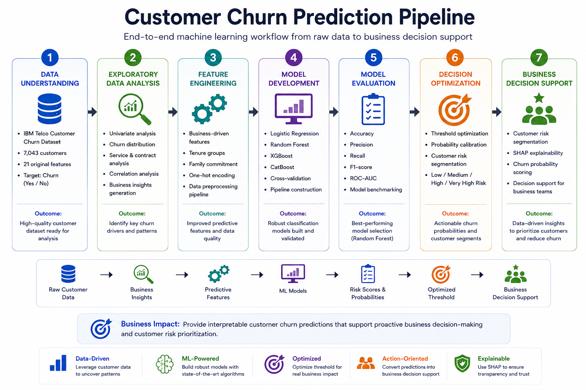

# Customer Churn Risk Prediction & Retention Analytics
An end-to-end machine learning project that predicts customer churn and demonstrates how predictive analytics can support business-driven retention strategies.





## Executive Summary

This project develops an end-to-end machine learning pipeline to predict customer churn and transform predictions into actionable business decisions.

Highlights include:

- Built and benchmarked four machine learning models
- Developed a modular end-to-end machine learning pipeline
- Optimized the decision threshold for business-oriented classification
- Demonstrated customer risk segmentation and retention analytics
- Applied SHAP explainability to interpret model predictions

The project demonstrates the complete lifecycle of a production-oriented data science solution, from exploratory analysis to business decision support.

## Project Overview

Customer churn is one of the most important challenges faced by subscription-based businesses. Acquiring new customers is significantly more expensive than retaining existing ones, making early identification of customers at risk of leaving a valuable business capability.

This project develops an end-to-end machine learning pipeline to predict customer churn using the IBM Telco Customer Churn dataset. Beyond predictive modelling, the project focuses on business interpretation by incorporating:

- Business-driven feature engineering
- Model benchmarking
- Threshold optimisation
- Customer risk segmentation
- Business impact simulation
- SHAP explainability

The objective is not only to predict churn accurately but also to demonstrate how machine learning can support customer retention strategies in a real business environment.

## Project Components

- Exploratory Data Analysis (EDA)
- Business-driven Feature Engineering
- Multiple ML Algorithms
  - Logistic Regression
  - Random Forest
  - XGBoost
  - CatBoost
- Model Benchmarking
- Threshold Optimisation
- Customer Risk Segmentation
- Business Impact Simulation
- SHAP Explainability

## Technologies

**Languages & Libraries**


## Model Performance

## Model Performance

| Model               | Accuracy | Precision | Recall | F1 Score | ROC-AUC | PR-AUC |
|---------------------|---------:|----------:|-------:|---------:|--------:|-------:|
| Random Forest       | 0.7573   | 0.5287    | **0.7888** | **0.6330** | **0.8445** | 0.6521 |
| Logistic Regression | 0.7317   | 0.4966    | 0.7861 | 0.6087 | 0.8420 | 0.6357 |
| CatBoost            | **0.8020** | **0.6578** | 0.5294 | 0.5867 | 0.8432 | **0.6565** |
| XGBoost             | 0.8006   | 0.6545    | 0.5267 | 0.5837 | 0.8410 | 0.6514 |

>**Selected model: Random Forest, chosen because it achieved the highest F1 score and strong recall, which better supports identifying customers at risk of churn.**

## Decision Threshold Optimization

Most classification models use a default probability threshold of **0.50** to convert predicted probabilities into class labels. However, this threshold is often arbitrary and may not provide the best trade-off between identifying churners (recall) and avoiding unnecessary retention actions (precision).

To improve business performance, the decision threshold was evaluated across a range of values using the F1 score as the optimization criterion.

| Threshold | Precision | Recall | F1 Score |
|----------:|----------:|-------:|---------:|
| 0.50 | 0.5287 | **0.7888** | 0.6330 |
| **0.54** | **0.5538** | 0.7567 | **0.6395** |

The optimized threshold of **0.54** increased the F1 score by improving precision while maintaining a high recall, resulting in a better balance between detecting customers likely to churn and limiting unnecessary retention interventions.

## 📈 Key Results & Visualizations

### 1. Key Exploratory Finding


Month-to-month customers exhibit substantially higher churn than customers on one-year or two-year contracts, establishing contract commitment as one of the clearest retention indicators.

### 2. Model Benchmarking


Random Forest was selected because it maintained high recall while achieving the highest F1-score, providing the best balance between detecting churners and limiting unnecessary retention interventions.

### 3. What Drives Customer Churn?

Contract type, customer tenure, pricing, internet service, and access to support services emerged as the strongest predictors. Month-to-month customers and customers early in their lifecycle represent particularly important retention segments.

### 4. Probability-Based Customer Risk Segmentation


The model successfully separates customers into meaningful risk groups. Observed churn rises from **5.7%** in the Low-Risk segment to **74.2%** in the Very-High-Risk segment, enabling retention teams to prioritise resources according to customer risk.

### 5. Explainable AI with SHAP


## Business Insights

The analysis demonstrates how churn predictions can support customer retention strategies by enabling:

- Early identification of high-risk customers
- Prioritised allocation of retention resources
- Explainable prediction using SHAP
- Data-driven retention decision making

## Repository Structure

```text
Customer-Churn-Prediction/
│
├── data/
│   ├── raw/
│   └── processed/
│
├── figures/
│   ├── churn_by_contract.png
│   ├── model_comparison.png
│   ├── feature_importance.png
│   ├── risk_segmentation.png
│   └── shap_summary.png
│
├── models/
│   ├── best_model.joblib
│
├── notebooks/
│   ├── 01_Exploratory_Data_Analysis.ipynb
│   ├── 02_Feature_Engineering_and_Model_Development.ipynb
│   └── 03_Model_Evaluation_and_Business_Insights.ipynb
│├── src/
│   ├── __init__.py
│   ├── config.py
│   ├── data_loader.py
│   ├── feature_engineering.py
│   ├── preprocessing.py
│   ├── model_training.py
│   ├── evaluation.py
│   ├── decision_threshold.py
│   └── model_io.py
│
├── train.py
├── README.md
└── requirements.txt

```
> The repository is organised to separate exploratory analysis, model development, trained models and supporting visualisations, making the workflow easy to follow and reproduce.

## Notebook Guide

| Notebook | Purpose |
|----------|---------|
| `01_Exploratory_Data_Analysis.ipynb` | Explores churn patterns across customer demographics, contracts, services, tenure and billing behaviour |
| `02_Feature_Engineering_and_Model_Development.ipynb` | Builds business-driven features, preprocessing pipelines and benchmarks multiple classification models |
| `03_Model_Evaluation_and_Business_Insights.ipynb` | Optimises the decision threshold, segments customers by risk, simulates business impact and explains predictions using SHAP |

## Dataset

The project uses the IBM Telco Customer Churn dataset, containing customer demographics, account information, subscribed services, billing characteristics and churn outcomes.

The modelling target is:

- `Churn = 1`: Customer left the provider
- `Churn = 0`: Customer remained with the provider

- Customers: 7,043
- Target churn rate: approximately 26.5%


## Business Impact

The business-impact simulation demonstrates how churn probabilities could support retention-budget allocation.

The simulation uses hypothetical assumptions for:

- Retention campaign cost
- Annual customer value
- Retention success rate

These figures are illustrative and should not be interpreted as an estimate of actual financial return.

## Installation

Clone the repository:

```bash
git clone https://github.com/Saptaparnineogi/Customer-Churn-Risk-Assessment-and-Retention-Analytics.git
cd Customer-Churn-Risk-Assessment-and-Retention-Analytics
````
````
conda create -n churn-prediction python=3.11
conda activate churn-prediction
````
````
pip install -r requirements.txt
````

### How to Run

```bash
python train.py

```

## Limitations

- The dataset is relatively small and represents a simplified telecom use case.
- Historical campaign-response data and customer lifetime value were unavailable.
- The financial-impact simulation uses illustrative assumptions.
- Feature importance and SHAP values explain model behaviour but do not establish causal relationships.
- The model has not been validated on an external or more recent customer population.


## Future Improvements

- Probability calibration
- Customer lifetime value modelling
- Profit-based threshold optimisation
- Hyperparameter tuning with Optuna
- Model monitoring and drift detection
- Deployment through a Streamlit application or REST API


## Conclusion

This project demonstrates an end-to-end machine learning workflow that extends beyond predictive modelling to business decision support.

By combining robust feature engineering, model benchmarking, explainable AI, and business-oriented evaluation, it illustrates how churn prediction can be translated into actionable customer retention strategies.
